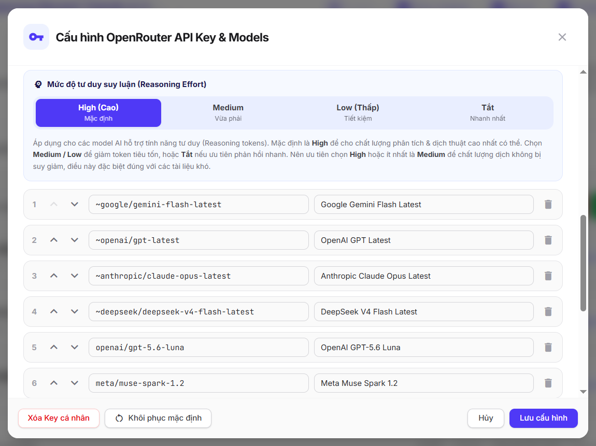

# silaBook-openSky

  
    <em>Giao diện cài đặt model của silaBook-openSky</em>

Dịch sách từ tiếng Anh sang tiếng Việt bằng bất cứ AI nào phù hợp qua cổng trung gian **[OpenRouter](https://openrouter.ai/)**.

- **Link web**: https://silabook-opensky.wpsila.com
- **Link app tren AI Studio**: https://aistudio.google.com/apps/6d89987c-21e6-4c75-921a-5fbf0e78cfa2?showPreview=true&showAssistant=true&fullscreenApplet=true (mọi người có thể remix về, và vibe coding thêm nếu muốn).

Ứng dụng web không cần đăng nhập, tạo tài khoản. Chỉ cần nhập API Key của OpenRouter là dùng được ngay. API Key được lưu cục bộ tại trình duyệt của người dùng, do vậy bạn chỉ nên dùng nó trên máy tính cá nhân của riêng bạn.

silaBook-openSky được phát triển dựa trên repo (v1.0.99) đã ổn định này: https://github.com/kiencang/silaBook (cùng tác giả).

## Lý do triển khai

Phiên bản ban đầu silaBook (https://github.com/kiencang/silaBook) hiện chỉ dùng được với Gemini, ngoài ra không kết hợp được với AI khác.

silaBook-openSky ra đời để phù hợp với nhu cầu kết hợp với rất nhiều model AI hiện có trên thị trường. Một điểm lợi thế của ứng dụng này là đa phần các chức năng lõi của nó (dịch sách, tạo bảng đại từ, tạo bảng thuật ngữ, tóm tắt, chia sách) đều có thể dùng các AI không cần phải là dạng đa phương thức (multimodal), nói cách khác là chỉ cần chuyển đổi từ text -> text, chứ không cần khả năng nhìn ảnh (ảnh vẫn giữ được trong bản dịch của công cụ này, vì nó là dạng link, công cụ chỉ cần giữ nguyên link đó đúng vị trí tương ứng).

Hệ quả của việc này là bạn có thể dùng rất nhiều AI chất lượng cao hiện không phải là dạng đa phương thức (trong đó có nhiều AI Trung Quốc với giá cả cự kỳ thân thiện, ví dụ như DeepSeek).

Phần duy nhất cần AI đa phương thức là chuyển PDF thành markdown, tuy nhiên chúng tôi cũng không khuyến khích bạn sử dụng AI để làm việc này, dù AI làm khá tốt (và ứng dụng có tích hợp sẵn khả năng chuyển đổi). Lý do là vì hiện có nhiều công cụ miễn phí chất lượng cao xử lý rất tốt nhiệm vụ đó, ví dụ như PaddleOCR (https://aistudio.baidu.com/paddleocr) hoặc OCR Z-AI (https://ocr.z.ai/).

### Giảm khả năng bị chặn dịch

Gemini có bộ chặn lọc nội dung khá gắt gao, điều này là cần thiết để tránh xử lý các nội dung có tiềm ẩn nguy cơ nguy hiểm hoặc gây hại, tuy nhiên mức độ chặn nhầm của nó là có, đặc biệt với thể loại tiểu thuyết với nhiều tình tiết hư cấu dễ gây hiểu nhầm. Các AI khác có mức chặn, hạn chế thấp hơn có thể hữu ích trong trường hợp này.

## Cách dùng

Không có điểm khác biệt đáng kể nào trong cách dùng bản openSky này với bản gốc. Chỉ có điểm khác duy nhất ở phần nhập API Key và bổ sung các model AI theo nhu cầu. Công cụ hướng dẫn rất chi tiết trong phần sử dụng tương ứng. Thao tác thêm mới các model, điều chỉnh một vài thông số cũng rất đơn giản. Nói chung nếu bạn đã từng dùng bản gốc thì bản openSky này gần như không phải học thêm gì nhiều.

## Các model AI

Danh sách các model quan trọng nhất có thể tìm thấy ở đây: https://openrouter.ai/discover

Có thể chia thành các nhóm model AI sau:
- (a) Nhóm các model AI có chất lượng cao nhất: Tốt nhất nhưng thường có giá rất cao;
- (b) **Nhóm các model có hiệu quả nhất cho mỗi đồng bỏ ra (Value leaders)**: Tuy không tốt nhất xét theo chất lượng thuần túy, nhưng giá lại cạnh tranh hơn nhiều;
- (c) Nhóm các model AI có tốc độ cao nhất (Fastest models);
- (d) Nhóm các model AI miễn phí;
- (e) Nhóm các model AI sử dụng bí danh (để luôn dùng model mới nhất và tránh phải cập nhật tên model liên tục): ví dụ các bí danh như `~anthropic/claude-opus-latest` là để chỉ model Claude bản mới nhất;

Với vai trò AI dịch thuật chúng ta nên tập trung vào các nhóm (a), (b), (e). Nhóm (c) tốc độ cao nhất không phải là trọng tâm trong dịch thuật. Nhóm (d) AI miễn phí các bạn có thể dùng để test, chất lượng của các model này rất khó để so sánh với các model trả phí chất lượng cao.

Đặt ở khía cạnh kinh tế, khi bạn dịch nhiều, các model nhóm (b) là đáng quan tâm nhất, chúng vẫn tiệm cận nhóm tốt nhất, nhưng giá lại rẻ hơn nhiều. Ngoài ra, dù tốc độ cao nhất không phải là mục tiêu, chúng ta cũng cần tránh dùng các AI quá chậm, vì dịch sách cần khá nhiều lời gọi với thao tác xử lý lớn.

**Lưu ý**: OpenRouter có phí nên các bạn nào muốn rẻ và vẫn có chất lượng tốt thì tham khảo repo chuyên cho Gemini (https://github.com/kiencang/silaBook), dịch không quá nhiều thì thậm chí bạn không tốn đồng nào vì ngưỡng miễn phí ngày của Gemini khá lớn. Chỉ bạn nào quan tâm đến việc dùng các AI khác (Claude, OpenAI, Grok, v.v...) thì mới cần quan tâm đến repo này.

### Để ý đến context đầu vào tối đa với các sách có dung lượng rất lớn

Mỗi AI đều có khả năng xử lý lượng đầu vào tối đa riêng. Đối với công cụ dịch sách này, ở phase phân tích đại từ là phase duy nhất mà nó cần nhìn lại tổng thể cả cuốn sách, nói cách khác nó sẽ đưa *toàn bộ cuốn sách* để phân tích trong luồng xử lý của nó.

Điều đó nghĩa là bạn không nên chọn AI có context quá thấp, chính xác hơn là không được thấp hơn số lượng token của cuốn sách mà bạn định dịch.

Ngày nay đa số các AI mạnh đều có context lên đến 1 triệu token, nó tương đương với 5 cuốn tiểu thuyết dầy như `Tội ác và Hình phạt` (bản tiếng Anh). Ở ngưỡng này hầu như chúng ta không bao giờ vượt qua.

Tuy nhiên cũng có một số model AI có đầu vào chấp nhận tương đối thấp, ví dụ 262K tokens (Hy3 preview), với ngưỡng này, thật ra cũng không mấy sách thông thường vượt qua được, nên cũng không quá lo.

Tóm lại: Trừ khi bạn định dịch cuốn sách tầm 1000 trang hoặc hơn, còn không thì không cần lo lắng về context của AI. Đối với đa số các AI hiện nay, thậm chí sách 1000 trang vẫn nằm trong khả năng xử lý của nó.

## Ghi công

Ứng dụng được phát triển tối ưu hoàn toàn ở phía Client-side (Trình duyệt). Một số thư viện quan trọng mà ứng dụng này dùng:

### 1. Khung Phát Triển Chính (Core Engine)
*   **[Angular](https://angular.dev/)**: Khung ứng dụng web đơn trang (SPA).

### 2. Giao Diện
*   **[Tailwind CSS](https://tailwindcss.com/)**: Framework utility-first CSS hỗ trợ xây dựng giao diện.
*   **[Angular Material Icons](https://material.angular.io/)**: Cung cấp hệ thống icon.

### 3. Xử Lý & Xuất Bản Tài Liệu (Document Processing)
*   **[docx](https://docx.js.org/)**: Thư viện chuyên dụng tạo cấu trúc tài liệu Word (`.docx`), hoạt động hoàn toàn phía client.
*   **[pdf-lib](https://pdf-lib.js.org/)**: Dùng để chia tách PDF thành các chunk (đoạn) để dễ xử lý hơn.
*   **[Mozilla PDF.js](https://mozilla.github.io/pdf.js/)** – Phát triển bởi **Mozilla**. Thư viện chạy hoàn toàn phía Client-side, giúp trích xuất text trong file PDF, phục vụ cho việc ước tính token trước khi chuyển PDF sang markdown.
*   **[JSZip](https://stuk.github.io/jszip/)**: Công cụ nén và đóng gói thư mục sách điện tử EPUB (`.epub`) ngay trên trình duyệt.
*   **[Marked & marked-footnote](https://marked.js.org/)**: Chuyển Markdown sang cấu trúc HTML, có hỗ trợ ghi chú chân trang (footnotes).
*   **[Turndown](https://github.com/mixmark-io/turndown)**: Chuyển đổi ngược các định dạng HTML thành cú pháp Markdown.

### 4. Lưu Trữ Nội Bộ (Local Database & Storage)
*   **[idb (IndexedDB Wrapper)](https://github.com/jakearchibald/idb)**: Thư viện wrap IndexedDB, hỗ trợ xử lý các tác vụ liên quan đến IndexedDB tốt hơn. Toàn bộ dữ liệu sách được lưu cục bộ tại trình duyệt là thông qua IndexedDB.

## Tuyên bố từ chối trách nhiệm
Công cụ này có thể được sử dụng cho mục đích nghiên cứu và học tập cá nhân.

silaBook-openSky cũng như người phát triển nó không đưa ra bất kỳ bảo đảm rõ ràng hay ngụ ý nào, cũng như không tuyên bố rằng công cụ sẽ vận hành hoàn hảo, chính xác hoặc cập nhật. Người phát triển sẽ không chịu trách nhiệm cho bất kỳ tổn thất hay thiệt hại nào phát sinh trực tiếp hoặc gián tiếp liên quan đến hoặc phát sinh từ việc sử dụng công cụ này.
